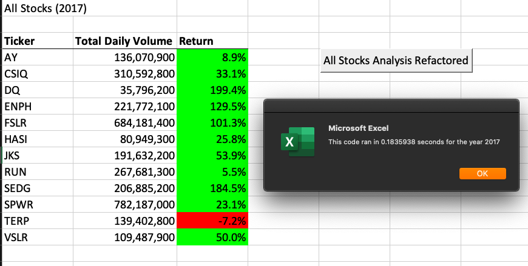
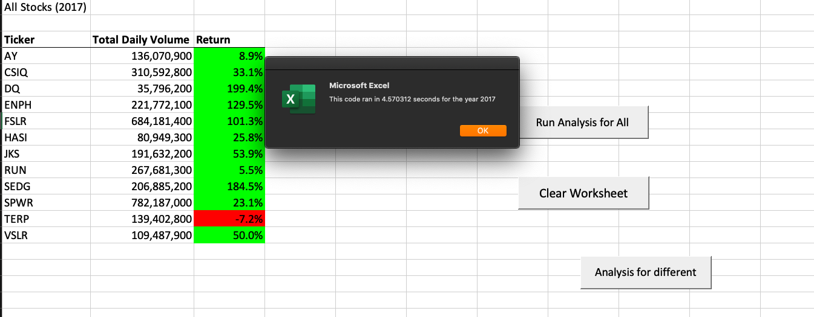
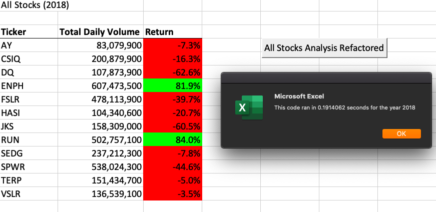
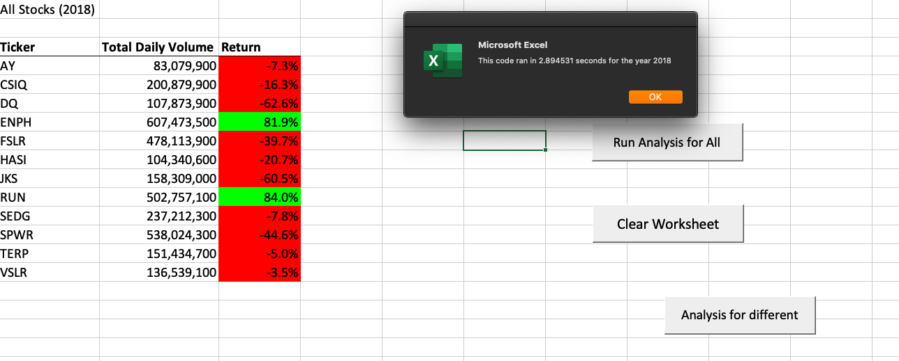

# stock-analysis
Performing stocks analysis for Steve's parents, by analyzing stocks' daily trading volumes and returns in both year 2017 and 2018.

## Overview of the project
This project edits and refactors the module 2 solution code to loop through all the data one time in order to collect the same information that we did in the module. Refactor is a key part of the coding process. When refactoring code, we are essentially making the code more efficient. 

### Purpose
Same as the results we got from "All Stocks Analysis" in module 2, we should be able to compare stocks performances and recognize targeting stocks to be invested in, or to be avoided. Overall, we should get the same results as we did in "All Stocks Analysis", but with less execution time. 

## Results

### As we can see from the results by looking at the yearly returns for each stock, 2017 was definitely a netter year than 2018 in terms of green stocks performances. Of all the stocks, RUN had a noticeable improvement: yearly return improved from 5.5% to 84%. As we have expected, The refactored code ran a shorter execution time than the original code did. Therefore, our refactored code did succeed in making our analysis more efficient. is therefore more efficient.

#### Comparison of Code Performance for 2017

#### Comparison of Code Performance for 2018

## Summary

### From the results given, it is evident that refactoring code creates more efficient pattern and therefore leads to more sustainable coding pattern for future uses. By factoring we were able to complete the same task all while taking fewer steps, using less memory, and making the overall structure more readable.

### Overall, the main advantage of refactoring code is that it improves code performance in terms of efficiency. On the contrary, the main disadvantage pf refactoring code is that it requires a lot more effort from the coder to re-write a module from scratch. 

## Coding Script

https://github.com/megaranc/stock-analysis/blob/main/Resources/VBA_Challenge.vbs
